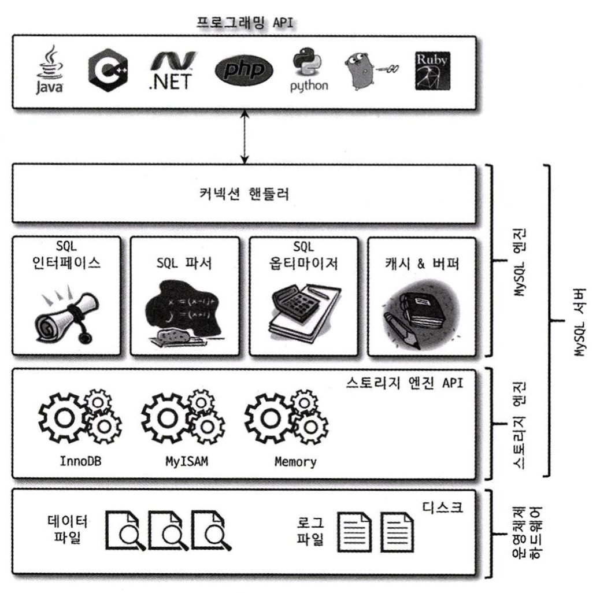
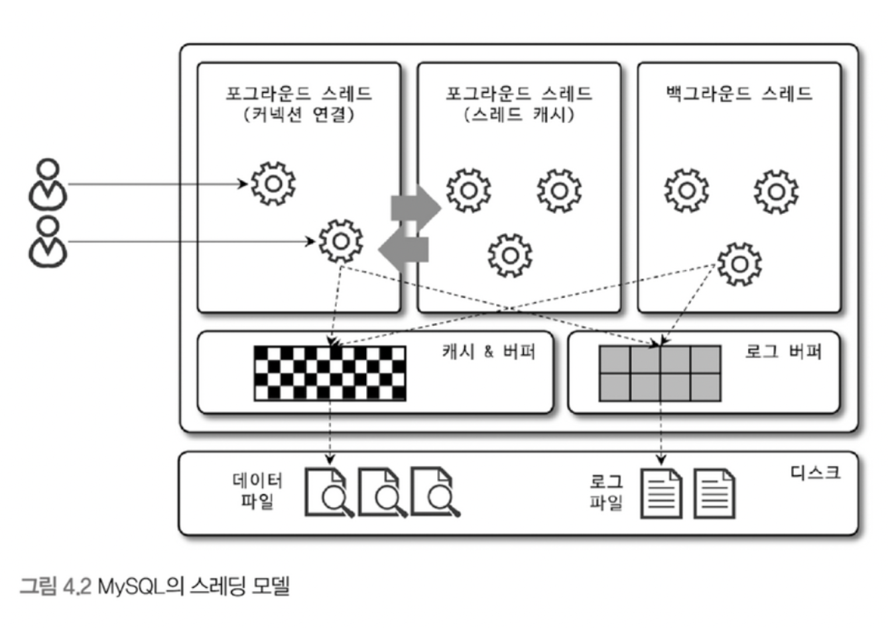

# 4장 아키텍처

MySQL서버는 사람의 머리역할을 담당하는 MySQL엔진과 손발 역할을 담당하는 스토리지 엔진으로 구분할 수 있다.
스토리지엔진은 손과 발의 역할을 담당
핸들러 API를 만족하면 누구든지 스토리지 엔진을 구현해서 MySQL 서버에 추가해서 사용할 수 있다

# 1. MySQL 엔진 아키텍처



MySQL 서버의 전체 구조

- MySQL 서버는 다른 DBMS에 비해 구조가 상당히 독특한 구조를 가진다
- 사용자 입장에서는 차이를 거의 못 느끼지만 이 구조가 주는 엄청난 혜택이 있다.
- 반면, 다른 DBMS에서는 문제되지 않을 것들이 문제가 되기도  한다.

---

## 1.1 MySQL 엔진

- MySQL엔진은 클라이언트로부터 접속 및 쿼리 요청을 처리하는 커넥션 핸들러와 SQL 파서 및 전처러기, 쿼리의 최적화된 실행을 위한 옵티마이저가 중심을 이룬다.

## 1.2 스토리지 엔진

- `MySQL 엔진`은 요청된 SQL 문장을 분석하거나 최적화하는 등 `두뇌 역할`
- `스토리지 엔진`은 실제 데이터를 디스크 스토리지에 `저장 및 읽어오는 역할`
- MySQL 서버에서 MYSQL 엔진은 하나지만 스토리지 엔진은 여러 개를 동시에 사용할 수 있다

```java
mysql> CREATE TABLE test_table (fd INT, fd2, INT) ENGINE=INNODB;
```

- 테이블이 사용할 `스토리지 엔진을 지정`하면 이후 해당 테이블의 `모든 읽기` 작업이나 `변경` 작업은 `정의된 스토리지 엔진이 처리`한다.
- 위의 예제에서는 test_table에
  INSERT, SELECT, DELETE, UPDATE 등 작업이 방생하면 INNODB 스토리지 엔진이 처리를 담당한다.

# 2. MySQL 스레딩 구조



- MySQL 서버는 프로세스 기반이 아닌 스레드 기반으로 작동
- 포그라운드와 백그라운드 스레드로 구분

## 2.1 포그라운드 스레드 (클라이언트 스레드)

- 포그라운드 스레스 수  = MySQL 서버에 접속된 클라이언트 수
- 각 클라이언트 사용자가 요청하는 쿼리 문장을 처리
- 클라이언트 사용자가 커넥션 종료시 `tread_cache_size 변수`에 따라 스래드 캐시(Thread Cahce)로 돌아가거나 스레드가 종료된다.
- 데이터 읽기 : 버퍼나 캐시로 가져옴, 없으면 직접 디스크나 인덱스 파일로 읽어와서 처리
- 데이터 쓰기 : INNODB 기준
    - 버퍼나 캐시까지만 포그라운드 스레드가 처리
    - 버퍼에서 디스키까지 기록은 백그라운드 스레드가 처리

## 2.2 백그라운드 스레드
